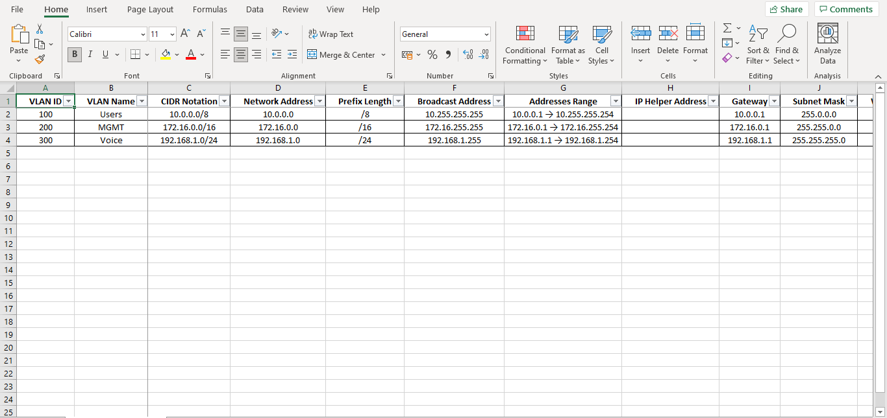

# A Subnet Calculator in Python3

## Table of Contents

1. [Getting Started](#getting-started)
2. [Installation](#installation)
3. [How it works?](#how-it-works)
4. [Preview](#preview)

### Getting Started

```bash
│   main.py
│   subnetting.py
│   export_subnets.py
│   requirements.txt
│   README.md
│   .gitignore
│
└───assets
        preview.png
```

---

### Installation

```bash
$ git clone https://github.com/Tes3awy/subnetting.git
$ cd subnetting
$ pip install -r requirements.txt --user
```

**OR**

1. Download from [Releases]().
2. `cd` into `subnetting` directory.
3. Run `path_to\subnetting> pip install -r requirements.txt --user` in terminal.

---

### How it works?

**Windows**

```powershell
path_to\subnetting> python main.py
```

**macOS or Linux**

```bash
$ python3 main.py
```

You will be prompted to enter _comma-seperated_ network subnet(s) in [CIDR notation](https://en.wikipedia.org/wiki/Classless_Inter-Domain_Routing#CIDR_notation) representation:

```bash
Enter network subnet(s) in CIDR Notation (comma-seperated): 10.0.0.0/8, 172.16.0.0/16, 192.168.1.0/24
```

Then you will be prompted to enter a name for the Excel file and the sheet within the Excel file that will hold all subnetting data:

```bash
Enter network subnet(s) in CIDR Notation (comma-seperated): 10.0.0.0/8, 172.16.0.0/16, 192.168.1.0/24
Name of Excel file w/o file extension? [Default IP-Schema]:
Worksheet name? [Default IP Schema]:
```

> w/o: Without

Voila :sparkles: You have an Excel file that includes all required data about each subnet.

```bash
Please check IP-Schema-6576ae0f-3e3a-47b5-bb25-ed9f45f813f7.xlsx in current working directory.
```

---

### Preview


