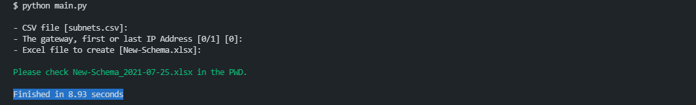

[](https://www.python.org/downloads)
[](https://github.com/Tes3awy/subnetting)
[](https://github.com/Tes3awy/subnetting)
[](https://github.com/psf/black)

# Advanced IPv4 Subnet Calculator in Python3

## Table of Contents

1. [Getting Started](#getting-started)
2. [Installation](#installation)
3. [How it works?](#how-it-works)
4. [Previews](#previews)

### Getting Started

```bash
│   main.py
│   read_subnets.py
│   subnetting.py
│   export_subnets.py
│   subnets.csv
│   requirements.txt
│   README.md
│   .pre-commit-config.yaml
│   .gitignore
│   LICENSE
│
└───assets
        preview.png
        subnets-csv.png
        subnetting-cli.png
```

---

### Installation

```bash
$ git clone https://github.com/Tes3awy/subnetting.git
$ cd subnetting
$ pip install -r requirements.txt --user
```

**OR**

1. Download from [Releases](https://github.com/Tes3awy/subnetting/releases/).
2. Extract `subnetting-<ver>.zip` file.
3. `cd` into `subnetting-<ver>` directory.
4. Run `path_to\subnetting-<ver>> pip install -r requirements.txt --user` in terminal.

---

### How it works?

**Windows**

```powershell
path_to\subnetting> python main.py
```

**macOS or Linux**

```bash
$ python3 main.py
```

You will be prompted to enter the name of the CSV file containing input subnets, a name for the Excel file to be created, and the name of the sheet within the Excel file that will hold all subnetting data. _(All inputs have default values)_:

```bash
- Name of subnets file w/ file extension? [Defaults to subnets.csv]:
- Name of Excel file w/o file extension? [Defaults to IP-Schema.xlsx]:
- Worksheet name? [Defaults to IP Schema Worksheet]:
```

> Abbreviations <br /> **w/: With** <br /> **w/o: Without**

Voila :sparkles: You have an Excel file that includes all required data about each subnet.

```bash
Please check IP-Schema-<EIGHT_CHARS_HASH>_<TODAYS_DATE>.xlsx in current working directory.
```

> **Default behaviors:**

> 1. CIDR notation with no prefix length will be handled as /32. <br /> For example, if you enter `10.0.0.0` omitting the prefix length in the CSV file, the script will handle it like `10.0.0.0/32`.

> 2. The header line **`Subnets in CIDR Notation`** within the `subnets.csv` file is automatically skipped. So, there is no need to manually remove it.

---

### Previews

**Terminal**


**CSV File (Input File)**


**Excel File (Output File)**

