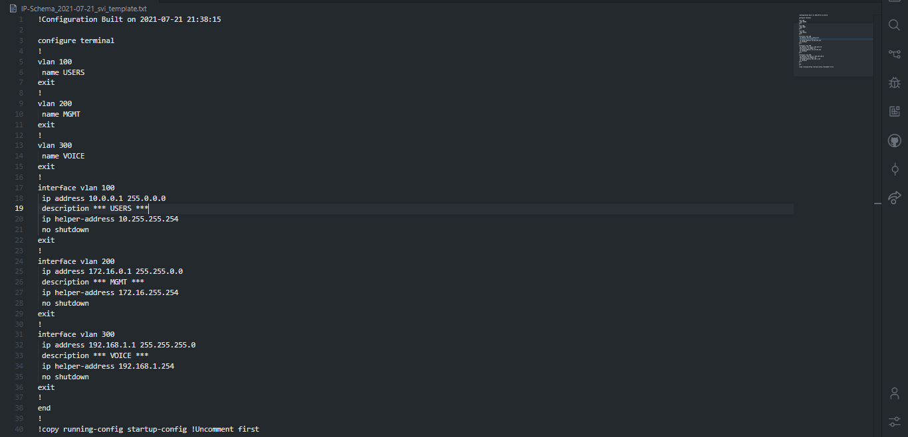

[](https://www.python.org/downloads)
[](https://code.visualstudio.com/)
[](https://github.com/Tes3awy/subnetting)
[](https://github.com/Tes3awy/subnetting/graphs/contributors)
[](https://github.com/Tes3awy/subnetting/releases)
[](https://github.com/Tes3awy/subnetting/commits/main)


[](https://github.com/Tes3awy/subnetting/stargazers)
[](https://github.com/Tes3awy/subnetting/network/members)
[](https://github.com/Tes3awy/subnetting/issues)
[](https://github.com/Tes3awy/subnetting/pulls?q=is%3Apr+is%3Aclosed)
[](https://github.com/Tes3awy/subnetting/blob/main/LICENSE)
[](https://github.com/psf/black)
[](https://pycqa.github.io/isort/)
[](https://github.com/pre-commit/pre-commit)

# Advanced IPv4 Subnet Calculator in Python3

## Table of Contents

1. [Getting Started](#getting-started)
2. [Installation](#installation)
3. [How it works?](#how-it-works)
4. [SVI Configuration Template](#svi-configuration-template)
5. [Previews](#previews)

### Getting Started

```bash
│   main.py
│   read_subnets.py
│   subnetting.py
│   export_subnets.py
│   parse_excel.py
│   svi_generator.py
│   svi.j2
│   subnets.csv
│   requirements.txt
│   README.md
│   .pre-commit-config.yaml
│   .gitignore
│   LICENSE
│
└───assets
        preview.png
        subnets-csv.png
        subnetting-cli.png
        svi-template.png
        svi.png
```

---

### Installation

```bash
$ git clone https://github.com/Tes3awy/subnetting.git
$ cd subnetting
$ pip install -r requirements.txt --user
```

**OR**

1. Download latest release from [Releases](https://github.com/Tes3awy/subnetting/releases/).
2. Extract `subnetting.zip` file.
3. `cd` into `subnetting` directory.
4. Run `path_to\subnetting> pip install -r requirements.txt --user` in terminal.

---

### How it works?

**Windows**

```powershell
path_to\subnetting> python main.py
```

**macOS or Linux**

```bash
$ python3 main.py
```

You will be prompted to enter the name of the CSV file containing input subnets, the gateway IP address, a name for the Excel file to be created, and the name of the sheet within the Excel file that will hold all subnetting data. _(All inputs have default values)_.

> A `subnets.csv` file can be found in the repo. This file is an entry point to get started using this program. It's prepopulated with three different subnets. _(Class A, Class B, and Class C)_.

```bash
- CSV file w/ extension? [Defaults to subnets.csv]:
- Gateway first or last IP Address? [0/1] [Defaults to 0]:
- Excel file w/o extension? [Defaults to IP-Schema]: Test-Schema
- Worksheet name? [Defaults to IP Schema Worksheet]: Test Worksheet
```

> - Abbreviations: <br /> - **w/: With** <br /> - **w/o: Without**

Voila :sparkles: You have an Excel file that includes all required data about each subnet.

```bash
Please check Test-Schema_<TODAYS_DATE>.xlsx in current working directory.
```

> **Default behaviors:**

> 1. CIDR notation with no prefix length will be handled as /32. <br /> - For example, if you enter `10.0.0.0` without a prefix length in the CSV file, the script will handle it like `10.0.0.0/32`.

> 2. The header line **`Subnets in CIDR Notation`** within the `subnets.csv` file is automatically skipped. So, there is no need to manually remove it.

> 3. Gateway input accepts 0 or 1 **ONLY** [Defaults to 0]. 0 picks the first IP address of the subnet, while 1 picks the last IP address.

> 4. Microsoft Excel does not allow worksheet name longer than 31 characters. Worksheet names longer than 31 chars will be truncated.

---

### SVI Configuration Template

Finally, if you have a L3 switch and you want to create [SVI interfaces](https://en.wikipedia.org/wiki/Switch_virtual_interface) of the created subnets on that switch, you can run:

```bash
$ python parse_excel.py --file Test-Schema-<TODAYS_DATE>.xlsx
```

This Python script will generate a text file including all VLANs and their SVI interfaces.

> **NOTE:** Make sure you add the VLAN ID and VLAN Name in all the cells in the generated Excel file before running this script. _Otherwise, VLAN ID and VLAN Name will be NaN_ in the generated text file.

---

### Previews

**Terminal**


**CSV File (Input File)**


**Excel File (Output File)**


**python parse_excel.py --file <file_name>.xlsx**


**SVI Template**

